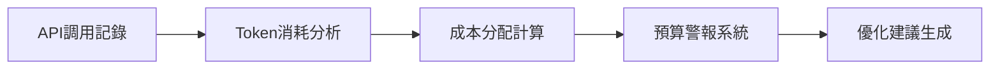

## AI Token成本危機：企業如何應對失控的人工智慧開支

2026年6月8日，全球企業正面临一场前所未有的AI成本危机。随着人工智能技术的广泛应用，许多公司发现自己陷入了"Token黑洞"——AI相关支出以惊人的速度吞噬着IT预算，甚至威胁到整个年度财务规划。本文将深入分析这场成本危机的根源、影响以及业界正在形成的解决方案。

### 危機現狀：數據揭示的嚴峻現實

**預算崩壞案例**

當前AI成本危機已經從理論變為現實，多家知名企業已經成為受害者：

- **Uber**：这家网约车巨头在2026年仅用了4个月就耗尽了整个年度AI编程预算
- **Microsoft**：撤销了开发人员的Claude Code许可证，显示出对AI成本的担忧
- **Priceline**：旅游网站Priceline报告称，Cursor服务的续约价格上涨了4-5倍
- **普遍现象**：许多企业发现AI支出超出预算3倍以上，有些甚至在上半年就达到了全年预算

**使用量爆炸性增長**

尽管单个Token的价格有所下降，但总体使用量却呈指数级增长：

1. **用户激增**：企业AI应用从少数部门扩展到全公司
2. **自主代理普及**：AI系统能够自主执行任务，24小时不间断产生Token消耗
3. **应用场景扩展**：从简单的文本生成扩展到复杂的代码编写、图像生成、数据分析等

### 成本危機的深層原因分析

**1. 早期「無限供應」模式的後遺症**

2025年初，AI厂商为了快速占领市场，推出了"无限使用"的订阅模式。许多企业在这种模式下大肆消费，没有建立成本监控机制：

- **缺乏成本意识**：技术团队过度使用AI功能，不考虑成本因素
- **预算分配不当**：IT预算中没有为AI设立专门的管理机制
- **使用标准缺失**：没有明确的AI使用指南和限制

**2. 技術複雜度提升**

AI技术的发展带来了新的成本挑战：

- **模型规模扩大**：新一代AI模型参数量呈指数级增长
- **推理成本增加**：复杂任务的推理过程需要更多计算资源
- **多模态应用**：文本、图像、音频等多模态AI应用同时运行

**3. 組織管理缺失**

许多企业在AI管理方面存在严重缺陷：

- **责任不明确**：IT部门、业务部门、数据科学团队之间责任模糊
- **缺乏透明度**：无法追踪各部门的AI使用情况
- **ROI评估困难**：难以量化AI投资的实际回报

### 業界應對策略：從混亂到有序

**1. 建立成本追蹤系統**

领先企业正在建立全面的AI成本监控系统：

**2. 實施FinOps 2.0模式**

传统的FinOps（云财务管理）正在向AI领域扩展：

- **实时监控**：建立24/7的AI使用监控机制
- **成本分摊**：将AI成本精确分配到各个业务部门
- **预算控制**：设置各部门的AI使用上限
- **优化建议**：基于使用模式提供成本优化建议

**3. 模型選擇策略**

明智的企业正在采用分层模型策略：

| 使用场景 | 推荐模型 | 成本效益 |
|---------|---------|---------|
| 简单文本处理 | 小型模型 | 高 |
| 代码生成 | 中型模型 | 中 |
| 复杂分析 | 大型模型 | 低 |
| 批量处理 | 自托管模型 | 最高 |

### Tokenomics Foundation的誕生

**標準化時代的來臨**

面对混乱的市场，Linux Foundation于本周宣布成立Tokenomics Foundation，这是一个旨在为AI Token成本建立标准化框架的新组织：

**核心目標**：
1. **建立行业标准**：制定Token使用和成本计算的统一标准
2. **开发最佳实践**：收集和分享AI成本管理的成功案例
3. **推动工具创新**：支持开发AI成本管理工具和平台
4. **促进协作**：连接企业、厂商和学术界的合作网络

**預期影響**：
- 提高成本透明度
- 降低管理成本
- 促进市场竞争
- 推动技术创新

### 企業實施指南：五步驟成本管控策略

**第一步：現狀評估**

- 全面审计当前的AI使用情况
- 识别成本异常的部门和应用
- 建立基准数据

**第二步：系統建設**

- 部署AI成本监控工具
- 建立数据收集和分析流程
- 设置预警机制

**第三步：政策制定**

- 制定AI使用政策
- 设置各部门的使用限额
- 建立审批流程

**第四步：技術優化**

- 优化提示词设计
- 实施缓存机制
- 选择合适的模型规模

**第五步：持續改進**

- 定期审查使用模式
- 调整策略和政策
- 培训员工提高成本意识

### 對台灣企業的特別建議

**機遇與挑戰**

台湾企业在AI成本管理方面既有机遇也有挑战：

**優勢**：
- 技术基础扎实
- 制造业经验丰富
- 成本敏感度高

**挑戰**：
- 人才储备不足
- 工具生态不完善
- 国际化程度有限

**實施建議**：

1. **分階段實施**
   - 先从关键部门开始
   - 逐步扩展到全公司
   - 建立长效机制

2. **利用現有工具**
   - 选择适合的AI管理平台
   - 整合现有IT系统
   - 降低实施成本

3. **培養成本文化**
   - 提高全员成本意识
   - 建立激励机制
   - 分享成功经验

### 未來展望：AI成本管理的趨勢

**1. 技術趨勢**

- **模型效率提升**：新一代模型将在保持性能的同时降低Token消耗
- **边缘计算普及**：更多AI计算将在本地完成，减少云服务依赖
- **自动化优化**：AI系统将自动优化自身的使用效率

**2. 市場趨勢**

- **定价模式创新**：厂商将推出更灵活的定价方案
- **专业服务兴起**：AI成本管理咨询和服务将形成新市场
- **标准化成熟**：行业标准和最佳实践将更加完善

**3. 組織趨勢**

- **AI财务官角色**：将出现专门负责AI成本的财务职位
- **跨部门协作**：IT、财务、业务部门将更紧密合作
- **数据驱动决策**：基于数据的AI投资决策将成为常态

### 結論：從成本危機到價值創新

AI Token成本危机不是终点，而是企业AI管理成熟化的开始。这场危机正在推动企业建立更加理性和可持续的AI使用模式。

对于企业而言，关键是要认识到AI不是"无限资源"，而是需要精心管理的战略资产。通过建立完善的成本管控体系，企业不仅可以控制支出，还能更有效地评估AI投资的ROI，实现从"成本中心"到"价值中心"的转变。

未来，随着Tokenomics等标准化组织的推动和技术的不断进步，AI成本管理将变得更加成熟和高效。那些能够率先建立有效成本管控机制的企业，将在激烈的市场竞争中占据优势地位。

在AI时代，成本管理能力将成为企业核心竞争力的重要组成部分。这场看似危机的挑战，实际上是企业数字化转型的必经之路，也是迈向更智能、更高效的未来的重要一步。